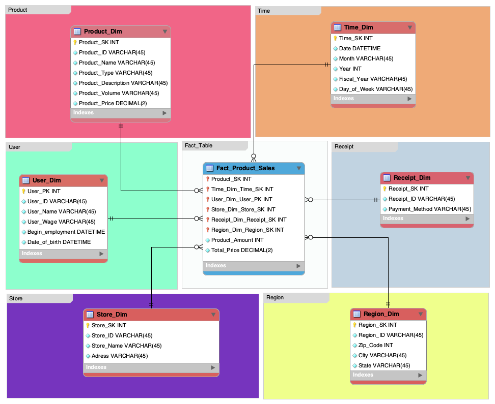
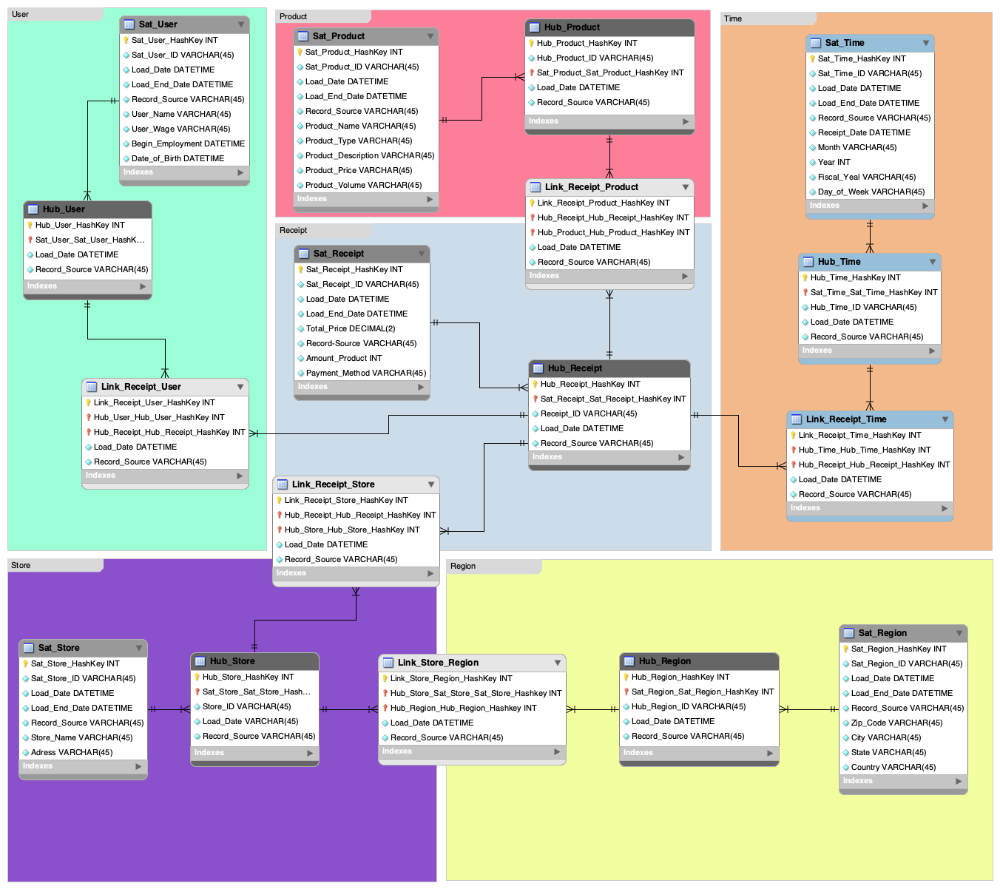

# Data Models for Pacific Pantry

This repository contains two data models designed for Pacific Pantry, a hypothetical Asian market chain based in Chinatown, San Francisco. The data models are implemented using MySQL and include:

1. **Star Schema Model**
2. **Data Vault Model**

## Background

The Asian market Pacific Pantry in Chinatown, San Francisco, has experienced significant gain in profitability in recent financial periods, as the demand for Asian products has continued to surge steadily. As a result, the owners have been able to open several more stores in the surrounding Bay Area cities. This complex organizational structure demanded for an integrated data structure of the different company branches. This data structure as per requirement of the company owners must allow for comprehensive analysis of sales, historical product performance, regional success metrics, and store performance across all locations. A centralized data repository can enable better decision-making and strategic planning for the future.

## Disclaimer

The case study presented here is hypothetical, and the Asian Market Chain Pacific Pantry does not exist. However, this fictitious scenario mirrors real-world situations commonly encountered in various industries. Employing such realistic, authentic scenarios is a widely accepted method for modeling procedures in scientific fields. Through this approach, complex concepts can be effectively conveyed in a relatable and understandable manner, facilitating comprehension and application of theoretical frameworks in practical contexts.

## Purpose

In this project, two methods for modeling a data warehouse were used based on a shopping basket receipt from a real grocery store: 

1. **Star Schema method** by Ralph Kimball
2. **Data Vault method** by Daniel Linstedt

Both methods were applied to the use case discussed above to determine their advantages and disadvantages.

## Project Structure

- **Star Schema Model**: Contains SQL script for creating tables based on the Star Schema method.

- **Data Vault Model**: Contains SQL script for creating tables based on the Data Vault method.

## Usage

1. Execute the SQL script in your MySQL environment to create the respective database schemas.
2. Populate the tables with relevant data from various sources.
3. Perform data analysis and queries based on your business requirements.

## Conclusion

The research paper accompanying this project compares the advantages and disadvantages of the Star Schema and Data Vault methods and determines the better method for the use case of the Pacific Pantry company.

For any inquiries or further information, please contact the project author.
